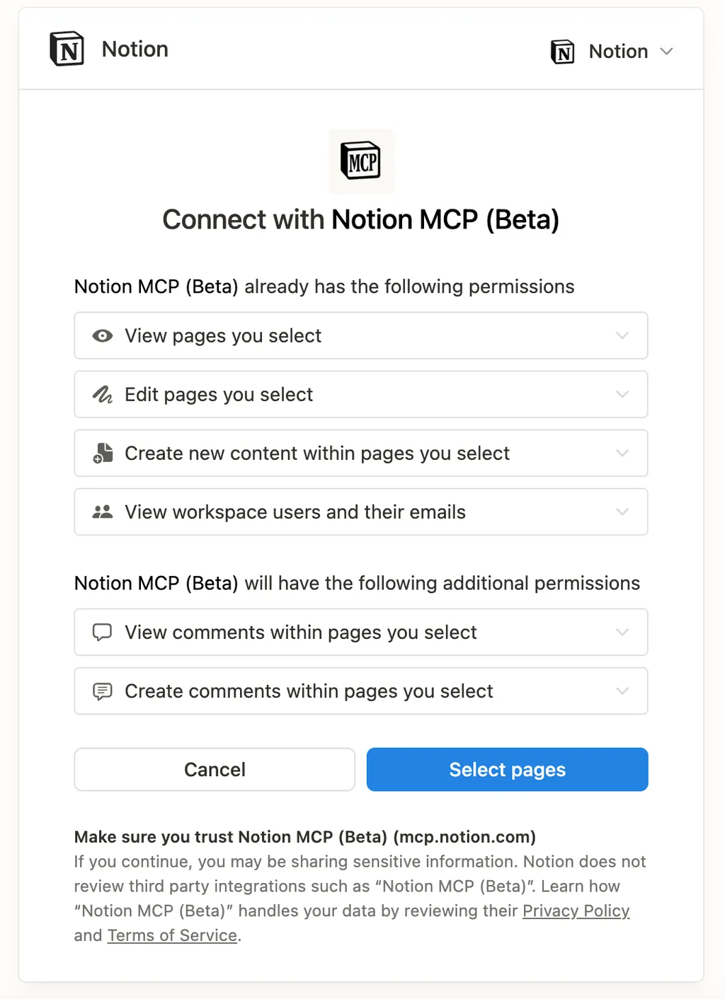
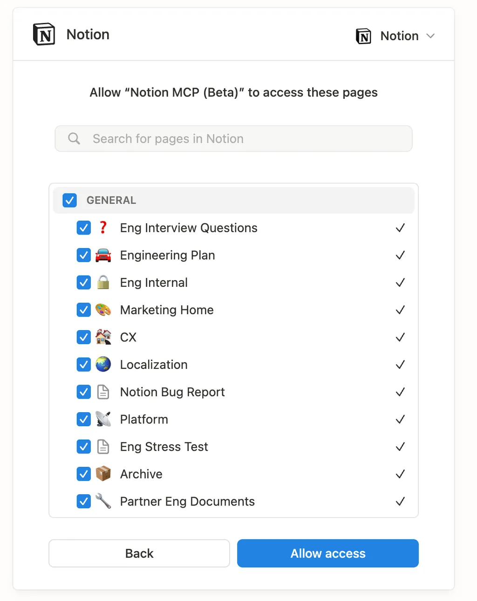

# Notion MCP Developer docs

## 🚚 Transport

Notion remote MCP server currently supports both Streamable HTTP and SSE transports.

- Streamable HTTP : https://mcp.notion.com/mcp (Recommended)
- SSE: https://mcp.notion.com/sse

## 🔒 Authentication

Upon connecting to the server, the OAuth flow will be kicked off. End user will go through the authorization code flow. Our MCP server will handle the token exchange process and return back to the client a unique set of refresh and access tokens.

Capabilities requested by Notion MCP (OAuth scopes)

- read_content
- update_content
- insert_content
- read_comment
- insert_comment
- view users with emails

## 🛠️ Tools

The following tools are currently implemented

- `create-pages`: creates multiple pages using markdown format in a parent page, database, or root workspace
- `search`: performs one or more semantic searches over your entire Notion workspaces and connected sources (Slack, Google Drive, Github, Jira, Microsoft Teams, Sharepoint, OneDrive, or Linear). Search results include full page content in markdown. AI subscription is required to use this tool
- `view`: Retrieves details about Notion entities by their URLs.
- `update-page`: Update a Notion page's properties or content
- `search-by-title`: this is the fallback search tool when AI subscription isn't available. It performs keyword search on page titles.
- `get-users` : lists all users in the workspace
- `get-self`: returns the current bot user
- `get-user`: gets details about a specific user
- `list-comments`: lists all comments on a page or block
- `create-a-comment`: adds a comment to a page or block
